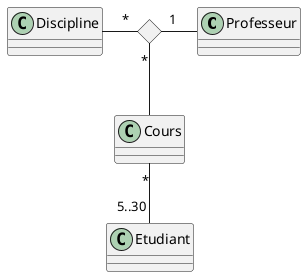

# Diagramme de classe

## Vrai ou faux

Etant donné le diagramme de domaine ci-dessus, les assertions suivantes sont-elles vraies ou fausses ? 
- Etudiant est une classe d’association - ❌ c'est une entité
- Un étudiant peut participer à autant de cours qu’il veut - ✅ car la cardinalité est *
- Plusieurs professeurs peuvent enseigner la même discipline - ❌ car la cardinalité est 1
- Un professeur peut enseigner plusieurs disciplines - ✅ car la cardinalité est *
- Un cours peut être enseigner à 2 étudiants - ❌ car la cardinalité est 5..30
- Un cours peut être enseigner à 20 étudiants - ✅ car la cardinalité est 5..30

## Question ouverte

Représentez la même association avec la notation UML « petit losange » 

- Quelles informations perd-on par rapport au diagramme ci-dessus ? 
Réponse: En représentant l'association avec la notation UML « petit losange » on ne peut plus dire que `cours` est une classe d'association etant donné que c'est `diamond "Enseignement"` qui fait la relation.

